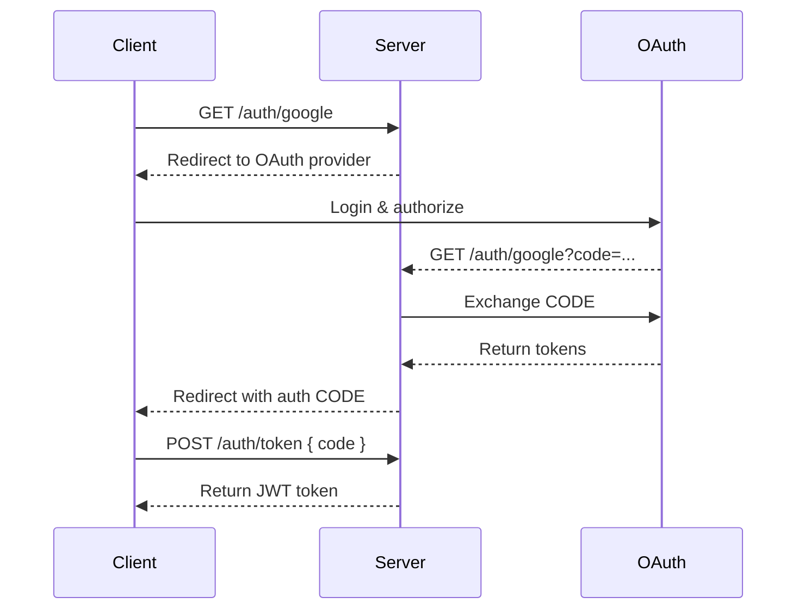

# API Reference

Complete API reference for Nuxt Aegis.

## Client-Side API

### Composables

- [`useAuth()`](/api/composables) - Authentication state and methods

## Server-Side API

### HTTP Endpoints

- [Authentication Endpoints](/api/endpoints) - REST API for authentication flows

### Server Utilities

- [Authentication Utils](/api/server-utils) - Server-side helper functions

### Event Handlers

- [OAuth Handlers](/api/event-handlers) - Define OAuth provider endpoints

## Type Definitions

- [TypeScript Types](/api/types) - Type definitions and interfaces

## Quick Reference

### Authentication Flow

### Common Operations

| Operation | Client API | Server API |
|-----------|------------|------------|
| Check auth | `const { isAuthenticated } = useAuth()` | `await getAuthUser(event)` |
| Get user | `const { user } = useAuth()` | `await requireAuth(event)` |
| Login | `await login('google')` | N/A |
| Logout | `await logout()` | N/A |
| Refresh | `await refresh()` | N/A |
