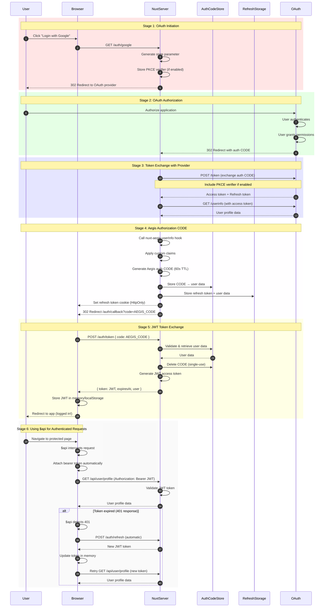
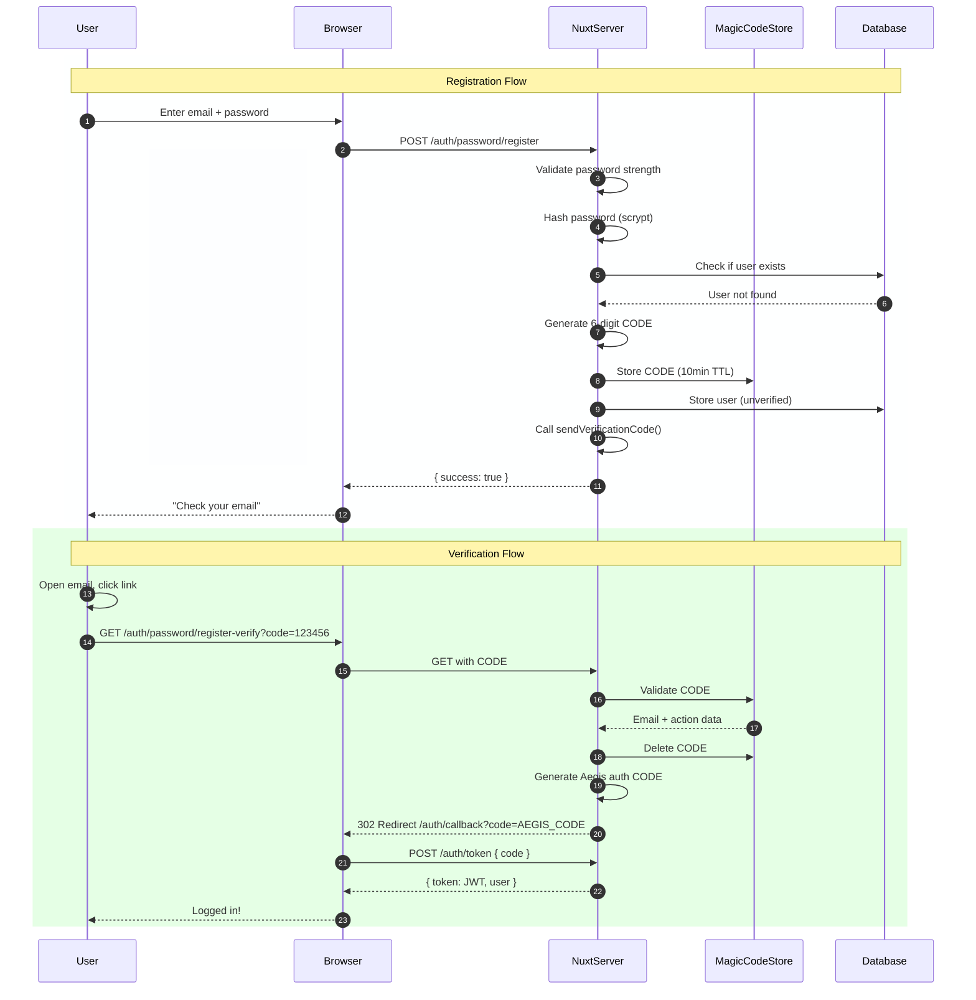
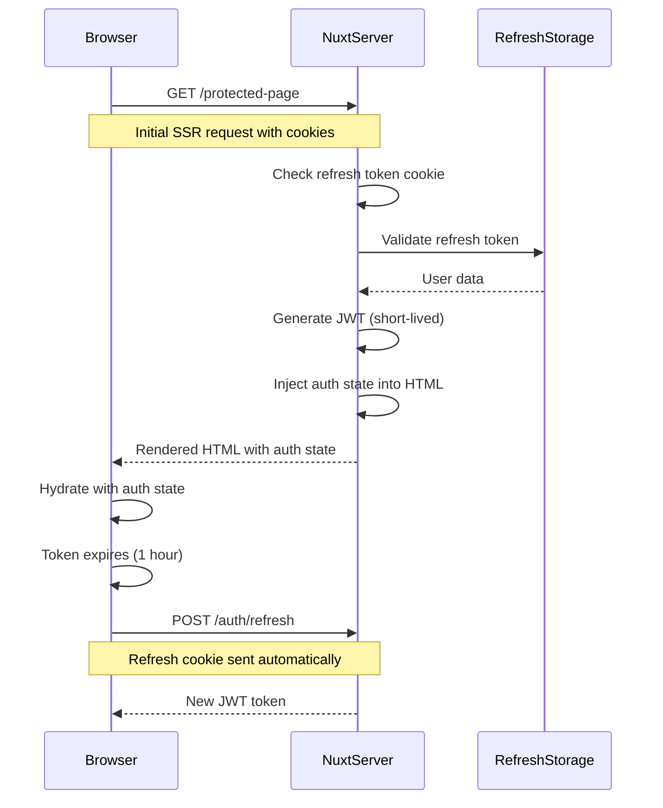

# Authentication Flow

Complete step-by-step authentication flow from login to token exchange.

## Overview

Nuxt Aegis implements a secure multi-stage authentication flow that combines OAuth 2.0, authorization CODEs, and JWT tokens. This page details the complete authentication process from initial login through token refresh.

## Complete Authentication Flow



## Authentication Stages

### Stage 1: OAuth Initiation

When a user clicks "Login with Google" (or any OAuth provider):

**1.1 Client Request**
```typescript
// User clicks login button
<NuxtLink href="/auth/google">Login with Google</NuxtLink>
```

**1.2 Redirect to Provider**
```typescript
const authUrl = new URL(provider.authorizationEndpoint)
authUrl.searchParams.set('client_id', clientId)
authUrl.searchParams.set('redirect_uri', redirectUri)
authUrl.searchParams.set('response_type', 'code')
authUrl.searchParams.set('scope', 'openid email profile')
authUrl.searchParams.set('state', state)

if (pkceEnabled) {
  authUrl.searchParams.set('code_challenge', codeChallenge)
  authUrl.searchParams.set('code_challenge_method', 'S256')
}

return sendRedirect(event, authUrl.toString(), 302)
```

### Stage 2: OAuth Authorization

**2.1 User Authentication**
- User authenticates with OAuth provider (Google, GitHub, etc.)
- User grants permissions to the application
- Provider validates credentials and consent

**2.2 Provider Callback**
```typescript
// Provider redirects back with auth CODE
GET /auth/google?code=OAUTH_CODE&state=STATE_VALUE
```

### Stage 3: Token Exchange with Provider

**3.1 Exchange Authorization CODE**
```typescript
const tokenResponse = await $fetch(provider.tokenEndpoint, {
  method: 'POST',
  body: {
    grant_type: 'authorization_code',
    code: oauthCode,
    redirect_uri: redirectUri,
    client_id: clientId,
    client_secret: clientSecret,
    code_verifier: codeVerifier, // PKCE
  },
})

// Receive: { access_token, refresh_token, id_token, expires_in }
```

**3.2 Fetch User Info**
```typescript
const userInfo = await $fetch(provider.userInfoEndpoint, {
  headers: {
    Authorization: `Bearer ${tokenResponse.access_token}`,
  },
})

// Receive: { sub, email, name, picture, ... }
```

### Stage 4: Aegis Authorization CODE

**4.1 Apply Hooks & Claims**
```typescript
// Call nuxt-aegis:userInfo hook
await callHook('nuxt-aegis:userInfo', {
  user: userInfo,
  provider: 'google',
  tokens: tokenResponse,
})

// Apply custom claims
const customClaims = await resolveCustomClaims(userInfo)
const enrichedUser = { ...userInfo, ...customClaims }
```

**4.2 Generate Aegis CODE**
```typescript
const aegisCode = randomBytes(32).toString('base64url')

// Store CODE with 60-second TTL
await authCodeStore.setItem(`authcode:${aegisCode}`, {
  user: enrichedUser,
  provider: 'google',
  expiresAt: Date.now() + 60000,
}, { ttl: 60 })
```

**4.3 Store Refresh Token**
```typescript
const refreshToken = randomBytes(32).toString('base64url')

await refreshTokenStorage.setItem(`refresh:${refreshToken}`, {
  user: enrichedUser,
  provider: 'google',
  createdAt: Date.now(),
}, { ttl: 604800 }) // 7 days
```

**4.4 Set Cookie & Redirect**
```typescript
setCookie(event, 'aegis_refresh', refreshToken, {
  httpOnly: true,
  secure: true,
  sameSite: 'lax',
  maxAge: 604800, // 7 days
})

return sendRedirect(event, `/auth/callback?code=${aegisCode}`, 302)
```

### Stage 5: JWT Token Exchange

**5.1 Client Exchanges CODE**
```typescript
// Client-side plugin intercepts callback
const { code } = route.query

const response = await $fetch('/auth/token', {
  method: 'POST',
  body: { code },
})

// Receive: { token: JWT, expiresAt: timestamp, user: {...} }
```

**5.2 Server Validates CODE**
```typescript
const codeData = await authCodeStore.getItem(`authcode:${code}`)

if (!codeData) {
  throw createError({ statusCode: 401, message: 'Invalid or expired CODE' })
}

// Delete immediately (single-use)
await authCodeStore.removeItem(`authcode:${code}`)
```

**5.3 Generate JWT**
```typescript
const payload = {
  sub: codeData.user.sub,
  email: codeData.user.email,
  name: codeData.user.name,
  ...customClaims,
  iat: Math.floor(Date.now() / 1000),
  exp: Math.floor(Date.now() / 1000) + 3600, // 1 hour
}

const token = await signJWT(payload, secret)
return { token, expiresAt, user: payload }
```

**5.4 Client Stores Token & Updates State**
```typescript
// Token stored in memory (not localStorage/sessionStorage)
setAccessToken(token)

// Update reactive auth state
user.value = response.user
isAuthenticated.value = true
```

### Stage 6: Using $api for Authenticated Requests

After authentication, use the `$api` plugin to make authenticated API calls:

**6.1 Automatic Bearer Token Injection**
```typescript
// In your component
const { $api } = useNuxtApp()

// $api automatically adds: Authorization: Bearer <token>
const data = await $api('/api/user/profile')
```

**6.2 Automatic Token Refresh on 401**

When a request returns 401 (token expired):

```typescript
// $api automatically:
// 1. Detects 401 response
// 2. Calls /auth/refresh endpoint
// 3. Updates token in memory
// 4. Retries original request with new token
const data = await $api('/api/protected/resource')
// ↑ Works even if token expired!
```

**6.3 SSR Token Handling**

During server-side rendering, `$api` uses a short-lived SSR token:

```vue
<script setup>
const { $api } = useNuxtApp()

// Works on both server (SSR token) and client (regular token)
const { data } = await useAsyncData('profile',
  () => $api('/api/user/profile')
)
</script>
```

::: tip Learn More
See the [$api Plugin Reference](/api/fetch-plugin) for detailed implementation information about automatic token handling, refresh logic, and best practices.
:::

const jwt = await sign(payload, jwtSecret, { algorithm: 'HS256' })
```

**5.4 Return to Client**
```typescript
return {
  token: jwt,
  expiresAt: payload.exp * 1000,
  user: {
    sub: payload.sub,
    email: payload.email,
    name: payload.name,
    // ... other claims
  },
}
```

**5.5 Client Stores Token**
```typescript
// Store access token in memory (reactive ref)
setAccessToken(response.accessToken)

// Decode token and update auth state
const tokenParts = response.accessToken.split('.')
const payload = JSON.parse(atob(tokenParts[1]))

// Update reactive auth state
authState.value = {
  user: payload,
  isLoading: false,
  error: null,
}

// Redirect to app
await navigateTo('/')
```

## Flow Variants

### Password Authentication Flow

For password-based authentication (non-OAuth):



### SSR Authentication Flow

For server-side rendered pages:



## Security Considerations

### CSRF Protection

**State Parameter**
- Random value passed to OAuth provider
- Returned in callback URL
- Can be used to prevent CSRF attacks
- Note: State validation is not currently implemented (TODO)

### PKCE (Proof Key for Code Exchange)

**Enabled for Public Clients**
```typescript
export default defineNuxtConfig({
  nuxtAegis: {
    providers: {
      google: {
        pkce: true, // Enable PKCE
      },
    },
  },
})
```

**Flow:**
1. Generate `code_verifier` (random 43-128 chars)
2. Create `code_challenge` = BASE64URL(SHA256(code_verifier))
3. Send `code_challenge` with auth request
4. Send `code_verifier` with token exchange
5. Provider verifies: SHA256(code_verifier) === code_challenge

### Token Security

| Token Type | Lifetime | Storage | Security |
|------------|----------|---------|----------|
| OAuth CODE | 60s | N/A | One-time use, PKCE |
| Aegis CODE | 60s | Memory | One-time use, random |
| JWT Token | 1 hour | Client | Signed, short-lived |
| Refresh Token | 7 days | Server + Cookie | HttpOnly, encrypted |

## Next Steps

- [Token Lifecycle](/architecture/token-lifecycle) - Token generation, validation, and refresh
- [Project Structure](/architecture/project-structure) - Codebase organization
- [Route Protection](/guides/route-protection) - Protecting routes and APIs
