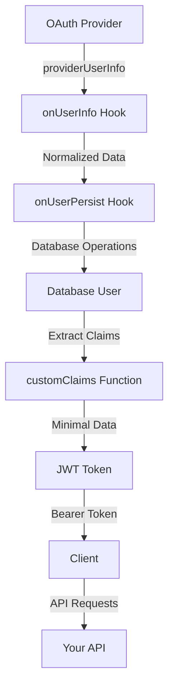

# Data Flow & Transformations

Understanding how user data flows through Nuxt Aegis is crucial for building secure and efficient authentication systems. This guide explains the three distinct types of user data and how they transform throughout the authentication lifecycle.

## Overview

Nuxt Aegis manages three conceptually different types of user data:

1. **Provider Info** - Raw OAuth provider response
2. **JWT Claims** - Lightweight token payload for authentication
3. **Database User** - Complete application-specific user record

Each serves a different purpose and has different constraints. Mixing them up is a common source of security issues and performance problems.

## The Three Types of User Data

### 1. Provider Info (`providerUserInfo`)

**What it is:** The raw, unprocessed data returned by an OAuth identity provider (Google, GitHub, Microsoft, etc.) after a user authenticates.

**Characteristics:**
- **Format:** Provider-specific - varies dramatically between providers
- **Availability:** Only during the initial OAuth callback
- **Lifecycle:** Transient - not stored by Nuxt Aegis
- **Trust level:** Should be validated before use
- **Use case:** Extract user identity to create/update your app's user records

**Examples by provider:**

```typescript
// Google OAuth Response
{
  sub: "1234567890",
  email: "user@example.com",
  email_verified: true,
  name: "John Doe",
  picture: "https://lh3.googleusercontent.com/...",
  given_name: "John",
  family_name: "Doe",
  locale: "en"
}

// GitHub OAuth Response
{
  id: 12345678,
  login: "johndoe",
  email: "user@example.com",
  name: "John Doe",
  avatar_url: "https://avatars.githubusercontent.com/...",
  html_url: "https://github.com/johndoe",
  bio: "Software developer",
  public_repos: 42,
  followers: 100
}

// Microsoft OAuth Response
{
  sub: "AAAAAAAAAAAAAAAAAAAAAIkzqFVrSaSaFHy782bbtaQ",
  name: "John Doe",
  email: "user@example.com",
  userPrincipalName: "user@example.com",
  jobTitle: "Senior Developer",
  officeLocation: "San Francisco"
}
```

**Key insight:** Provider info is **ephemeral** and **inconsistent**. You must transform it into your application's data model.

### 2. JWT Claims (`AppTokenClaims`)

**What it is:** Your application-specific token payload that gets encoded into the JWT access token and sent with every authenticated request.

**Characteristics:**
- **Format:** Standardized for your application (you define it)
- **Availability:** Sent with every API request in the `Authorization` header
- **Lifecycle:** Lives for the token's lifetime (typically 15-60 minutes)
- **Size constraint:** Keep under 1KB for performance
- **Trust level:** Cryptographically signed by your server
- **Use case:** Fast, stateless authentication and authorization checks

**Type definition:**

```typescript
// shared/types/token.ts
import type { CustomTokenClaims } from '#nuxt-aegis'

export type AppTokenClaims = CustomTokenClaims<{
  role: string           // User role (e.g., 'admin', 'user')
  permissions: string[]  // Specific permissions
  organizationId: string // Multi-tenant identifier
}>

// The full token payload includes:
// - sub: user ID
// - email: user email
// - name: display name
// - picture: avatar URL
// - iat: issued at timestamp
// - exp: expiration timestamp
// + your custom claims above
```

**What to include in JWT claims:**

✅ **DO include:**
- User ID (`sub`)
- Basic identity (email, name, picture)
- Authorization data (role, permissions)
- Tenant/organization identifiers
- Small, frequently-needed values

❌ **DON'T include:**
- Passwords or secrets
- Large data (profile descriptions, settings)
- Frequently-changing data (last login time)
- Sensitive personal data (SSN, phone numbers)
- Database implementation details

**Why size matters:**
- Sent with **every request** (bandwidth cost)
- Larger tokens = slower parsing and validation

### 3. Database User (`DatabaseUser`)

**What it is:** The complete, authoritative user record stored in your application's database.

**Characteristics:**
- **Format:** Application-specific (your database schema)
- **Availability:** Persisted permanently, fetched when needed
- **Lifecycle:** Permanent until deleted
- **Size constraint:** No practical limit
- **Trust level:** Source of truth for your application
- **Use case:** Store complete user profile, preferences, settings, and relationships

**Type definition:**

```typescript
// shared/types/database.ts
import type { AppTokenClaims } from './token'

export interface DatabaseUser extends AppTokenClaims {
  id: string
  email: string
  name: string
  picture: string
  
  // Database-specific fields (NEVER in JWT)
  hashedPassword?: string     // For password authentication
  createdAt: string
  lastLogin: string
  emailVerified: boolean
  
  // Multi-provider support
  providers: Array<{
    name: string              // 'google', 'github', 'password'
    id: string                // Provider-specific user ID
  }>
  
  // Application-specific data
  preferences: {
    theme: 'light' | 'dark'
    notifications: boolean
    language: string
  }
  
  // Audit fields
  updatedAt: string
  updatedBy?: string
  
  // Relationships (IDs only, not full objects)
  teamIds: string[]
  projectIds: string[]
}
```

**What to include in database:**

✅ **DO include:**
- Everything from JWT claims (for reference)
- Hashed passwords and credentials
- Multi-provider authentication records
- Detailed profile information
- User preferences and settings
- Audit trails (created, updated timestamps)
- Relationships to other entities
- Large or rarely-needed data

## Data Transformation Flow

Here's how data flows through the authentication process:



### Step-by-Step Transformation

#### Step 1: OAuth Callback (Provider → `providerUserInfo`)

When a user authenticates with an OAuth provider, you receive provider-specific data:

```typescript
// This is automatically provided by Nuxt Aegis
const providerUserInfo = {
  sub: "1234567890",
  email: "john@example.com",
  name: "John Doe",
  email_verified: true,
  // ... other provider-specific fields
}
```

#### Step 2: Normalize (`onUserInfo` Hook)

Transform provider-specific data into a consistent format:

```typescript
// server/plugins/aegis.ts
defineAegisHandler({
  onUserInfo: async (payload) => {
    // Normalize field names across providers
    if (!payload.providerUserInfo.id && payload.providerUserInfo.sub) {
      payload.providerUserInfo.id = payload.providerUserInfo.sub
    }
    
    // Add metadata
    payload.providerUserInfo.authenticatedAt = new Date().toISOString()
    payload.providerUserInfo.authProvider = payload.provider
    
    return payload.providerUserInfo
  }
})
```

#### Step 3: Persist (`onUserPersist` Hook)

Create or update the database user and return enrichment data for the JWT:

```typescript
// server/plugins/aegis.ts
defineAegisHandler({
  onUserPersist: async (user, { provider }) => {
    const email = user.email as string
    const providerId = String(user.id || user.sub)
    
    // Check if user exists
    let dbUser = findUserByProvider(provider, providerId)
    
    if (!dbUser) {
      // Check by email (for multi-provider linking)
      dbUser = getUserByEmail(email)
      
      if (dbUser) {
        // Link new provider to existing user
        linkProviderToUser(dbUser.id, { name: provider, id: providerId })
      } else {
        // Create new user
        dbUser = createUser({
          email,
          name: user.name as string,
          picture: user.picture as string,
          role: 'user',
          permissions: ['read'],
          organizationId: 'default',
          providers: [{ name: provider, id: providerId }],
          createdAt: new Date().toISOString(),
          lastLogin: new Date().toISOString()
        })
      }
    }
    
    // Update last login
    updateUser(dbUser.id, { lastLogin: new Date().toISOString() })
    
    // Return ONLY data needed for JWT claims
    return {
      userId: dbUser.id,
      role: dbUser.role,
      permissions: dbUser.permissions,
      organizationId: dbUser.organizationId
    }
  }
})
```

#### Step 4: Create JWT (`customClaims`)

Optionally add provider-specific claims to the JWT:

```typescript
// server/routes/auth/google.ts
export default defineOAuthGoogleEventHandler({
  customClaims: async (user, tokens) => {
    // user = normalized providerUserInfo
    // Add Google-specific claims if needed
    return {
      emailVerified: user.email_verified || false,
      locale: user.locale || 'en'
    }
  }
})
```

The final JWT payload combines:
- Standard claims (sub, email, name, picture, iat, exp)
- Data from `onUserPersist` return value
- Data from `customClaims` return value

```typescript
// Resulting JWT payload:
{
  sub: "db-user-id-123",
  email: "john@example.com",
  name: "John Doe",
  picture: "https://...",
  role: "user",                    // from onUserPersist
  permissions: ["read"],           // from onUserPersist
  organizationId: "default",       // from onUserPersist
  emailVerified: true,             // from customClaims
  locale: "en",                    // from customClaims
  iat: 1703419200,
  exp: 1703422800
}
```

#### Step 5: Client Usage

The client receives the JWT and uses it for authentication:

```typescript
// Client-side (app.vue)
const { user, accessToken } = useAuth<AppTokenClaims>()

// Access typed custom claims
console.log(user.value?.role)           // 'user'
console.log(user.value?.permissions)    // ['read']

// API calls automatically include the token
const response = await $fetch('/api/protected', {
  headers: {
    Authorization: `Bearer ${accessToken.value}`
  }
})
```

#### Step 6: Server-side Authorization

Your API routes verify the JWT and use claims for authorization:

```typescript
// server/api/admin.ts
export default defineEventHandler(async (event) => {
  // Extract and verify JWT
  const user = getAuthUser<AppTokenClaims>(event)
  
  // Use claims for authorization
  if (user.role !== 'admin') {
    throw createError({ statusCode: 403, message: 'Admin access required' })
  }
  
  // Optionally fetch full database user for complex operations
  const dbUser = await getUserById(user.sub)
  
  return {
    message: 'Admin data',
    preferences: dbUser.preferences
  }
})
```

## Common Patterns & Best Practices

### Pattern 1: Multi-Provider Account Linking

Link multiple OAuth providers to a single user account:

```typescript
defineAegisHandler({
  onUserPersist: async (user, { provider }) => {
    const email = user.email as string
    const providerId = String(user.id || user.sub)
    
    // First check by provider ID
    let dbUser = findUserByProvider(provider, providerId)
    
    if (!dbUser) {
      // Then check by email
      dbUser = getUserByEmail(email)
      
      if (dbUser) {
        // Same email, different provider → link accounts
        linkProviderToUser(dbUser.id, { name: provider, id: providerId })
        console.log(`Linked ${provider} to existing user ${email}`)
      } else {
        // New user entirely
        dbUser = createUser({
          email,
          name: user.name as string,
          providers: [{ name: provider, id: providerId }],
          // ... other fields
        })
      }
    }
    
    return {
      userId: dbUser.id,
      role: dbUser.role,
      permissions: dbUser.permissions
    }
  }
})
```

### Pattern 2: Role-Based Access Control (RBAC)

Store roles in database, include in JWT for fast checks:

```typescript
// Database: Source of truth
interface DatabaseUser {
  role: 'admin' | 'moderator' | 'user' | 'guest'
  permissions: string[]
}

// JWT: Fast authorization checks
type AppTokenClaims = CustomTokenClaims<{
  role: string
  permissions: string[]
}>

// Middleware: Check without database query
export default defineEventHandler((event) => {
  const user = getAuthUser<AppTokenClaims>(event)
  
  if (!user.permissions.includes('write')) {
    throw createError({ statusCode: 403 })
  }
})
```

### Pattern 3: Minimal JWT, Database Lookup

Keep JWT small, fetch database user only when needed:

```typescript
// JWT contains minimal claims
type AppTokenClaims = CustomTokenClaims<{
  role: string
}>

// Fetch full user only for complex operations
export default defineEventHandler(async (event) => {
  const jwtUser = getAuthUser<AppTokenClaims>(event)
  
  // Quick authorization check (no DB query)
  if (jwtUser.role !== 'admin') {
    throw createError({ statusCode: 403 })
  }
  
  // Fetch full user only when needed
  const dbUser = await getUserById(jwtUser.sub)
  
  return {
    profile: dbUser,
    preferences: dbUser.preferences
  }
})
```

### Pattern 4: Provider-Specific Enrichment

Add provider-specific data without cluttering the database:

```typescript
// Google: Email verification status
export default defineOAuthGoogleEventHandler({
  customClaims: (user) => ({
    emailVerified: user.email_verified || false
  })
})

// GitHub: Public repositories count
export default defineOAuthGitHubEventHandler({
  customClaims: (user) => ({
    githubRepos: user.public_repos || 0
  })
})
```

## Security Considerations

### 🔒 Never Put Secrets in JWT

```typescript
// ❌ WRONG - Secrets in JWT
type AppTokenClaims = CustomTokenClaims<{
  hashedPassword: string  // NEVER DO THIS
  apiKey: string         // NEVER DO THIS
  creditCard: string     // NEVER DO THIS
}>

// ✅ CORRECT - Only safe data in JWT
type AppTokenClaims = CustomTokenClaims<{
  role: string
  permissions: string[]
}>

// Store secrets in database only
interface DatabaseUser {
  hashedPassword: string  // OK in database
  apiKeys: string[]      // OK in database
}
```

### 🔒 Validate Provider Data

Provider data is external input and must be validated:

```typescript
defineAegisHandler({
  onUserInfo: async (payload) => {
    const email = payload.providerUserInfo.email
    
    // Validate email
    if (!email || typeof email !== 'string') {
      throw createError({ statusCode: 400, message: 'Invalid email from provider' })
    }
    
    // Validate email format
    if (!/^[^\s@]+@[^\s@]+\.[^\s@]+$/.test(email)) {
      throw createError({ statusCode: 400, message: 'Invalid email format' })
    }
    
    return payload.providerUserInfo
  }
})
```

### 🔒 Separate Token and Database Types

Prevent accidental leakage by using different types:

```typescript
// ❌ WRONG - Same type for both
type User = {
  id: string
  email: string
  hashedPassword: string  // Oops, might leak to JWT
}

// ✅ CORRECT - Separate types
type AppTokenClaims = CustomTokenClaims<{
  role: string
}>

interface DatabaseUser extends AppTokenClaims {
  hashedPassword: string  // TypeScript prevents this from going to JWT
}
```

## See Also

- [Custom Claims Guide](../guides/custom-claims.md) - Deep dive into JWT customization
- [Type Definitions](../guides/types/) - TypeScript type documentation
- [Event Handlers](../guides/handlers.md) - Hook reference
- [Authentication Flow](./authentication-flow.md) - Complete flow diagrams
- [Token Lifecycle](./token-lifecycle.md) - Token management and refresh