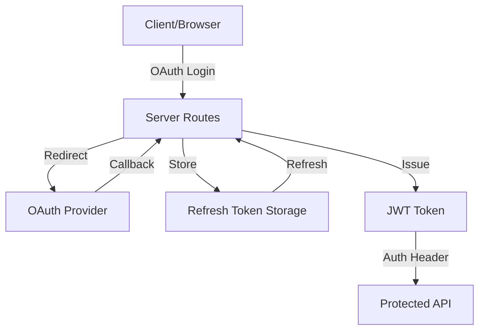
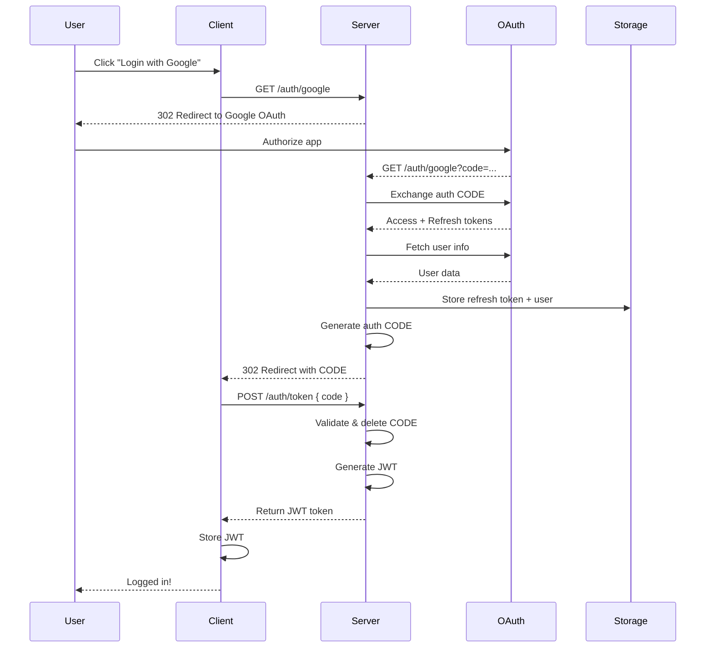
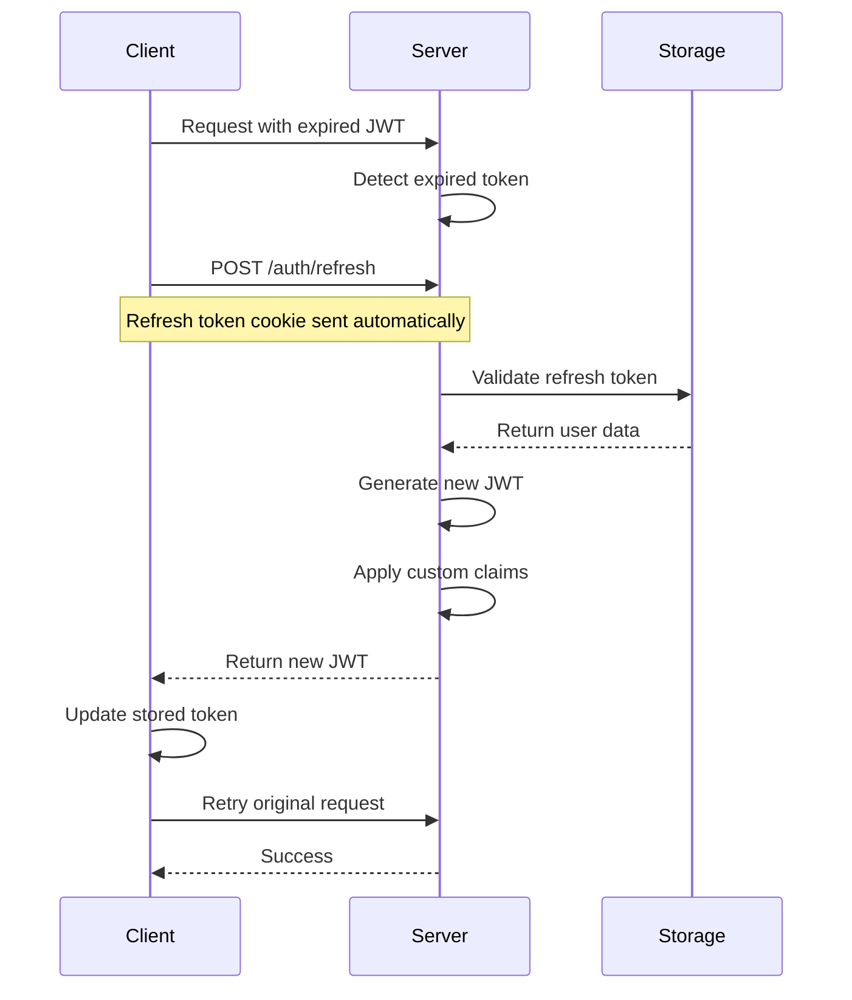
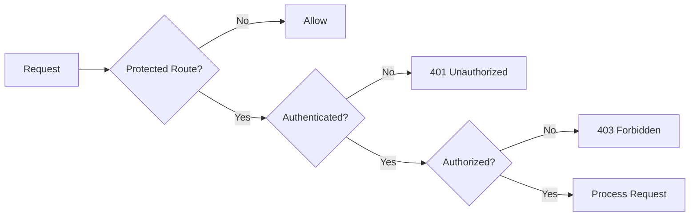
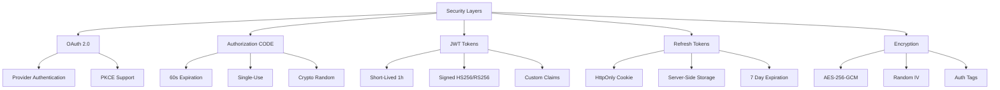
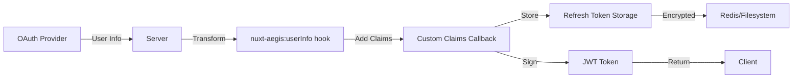

# Architecture

Understanding Nuxt Aegis architecture and authentication flows.

## Overview

Nuxt Aegis implements a secure OAuth 2.0 + JWT authentication system with token refresh and authorization CODE flow.

## Key Components



### Client-Side Components

- **`useAuth()` Composable** - Reactive authentication state management
- **Router Middleware** - Client-side route protection
- **Token Storage** - JWT access token management
- **Refresh Cookie** - HttpOnly refresh token cookie

### Server-Side Components

- **OAuth Routes** - Handle OAuth flows (`/auth/{provider}`)
- **Token Endpoints** - Token exchange and refresh (`/auth/token`, `/auth/refresh`)
- **Server Middleware** - Automatic route protection
- **Server Utils** - `requireAuth()`, `getAuthUser()`
- **Storage Layer** - Persistent refresh token storage (Redis/filesystem)

### Authentication Flow

Detailed authentication flow documentation:

- [Complete Authentication Flow](/architecture/authentication-flow)
- [Token Lifecycle](/architecture/token-lifecycle)
- [Project Structure](/architecture/project-structure)

## Architecture Diagrams

### High-Level Flow



### Token Refresh Flow



### Route Protection Flow



## Security Layers



## Data Flow

### User Data Storage



### Token Types

| Token Type | Lifetime | Storage | Purpose |
|------------|----------|---------|---------|
| **Authorization CODE** | 60 seconds | Memory | Exchange for JWT |
| **JWT Access Token** | 1 hour | Client (memory/localStorage) | API authentication |
| **Refresh Token** | 7 days | Server (Redis/filesystem) | Generate new JWTs |
| **OAuth Provider Tokens** | Varies | Not stored | Fetch user info only |

## Module Integration

```mermaid
graph TB
    A[Nuxt App] --> B[nuxt-aegis Module]
    B --> C[Runtime Plugin]
    B --> D[Server Routes]
    B --> E[Server Middleware]
    B --> F[Composables]
    
    C --> C1[Token Store]
    C --> C2[API Client]
    
    D --> D1[/auth/provider]
    D --> D2[/auth/token]
    D --> D3[/auth/refresh]
    D --> D4[/auth/logout]
    
    E --> E1[Route Protection]
    E --> E2[Token Validation]
    
    F --> F1[useAuth]
    
```

## Performance Considerations

### Caching Strategy

- **JWT tokens**: Short-lived (1h) to balance security and performance
- **Refresh tokens**: Long-lived (7 days) to minimize re-authentication
- **User data**: Cached with refresh token, regenerated on refresh

### Scalability

- **Stateless JWTs**: No server-side session storage for access tokens
- **Redis storage**: Horizontal scaling for refresh tokens
- **Token refresh**: Automatic refresh prevents auth interruptions

## Next Steps

- [Complete Authentication Flow](/architecture/authentication-flow)
- [Token Lifecycle](/architecture/token-lifecycle)
- [Project Structure](/architecture/project-structure)
