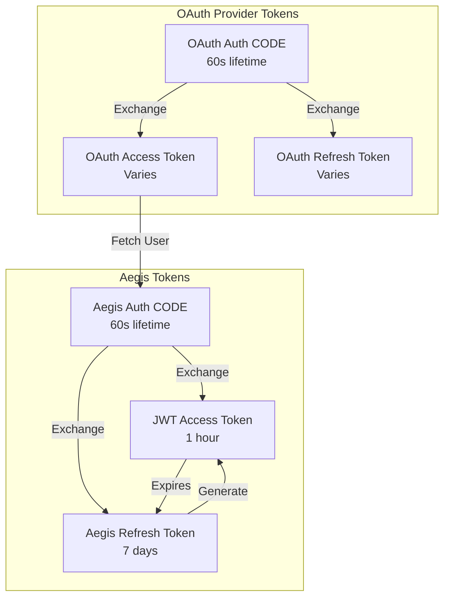
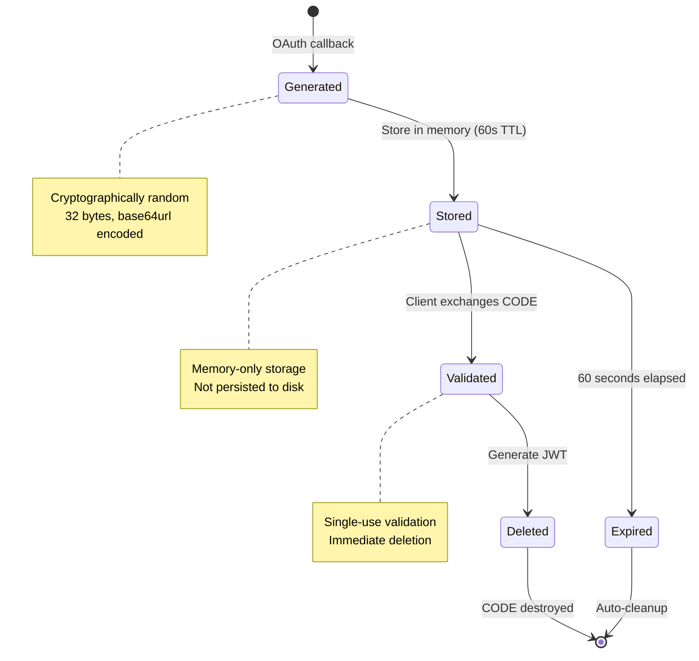
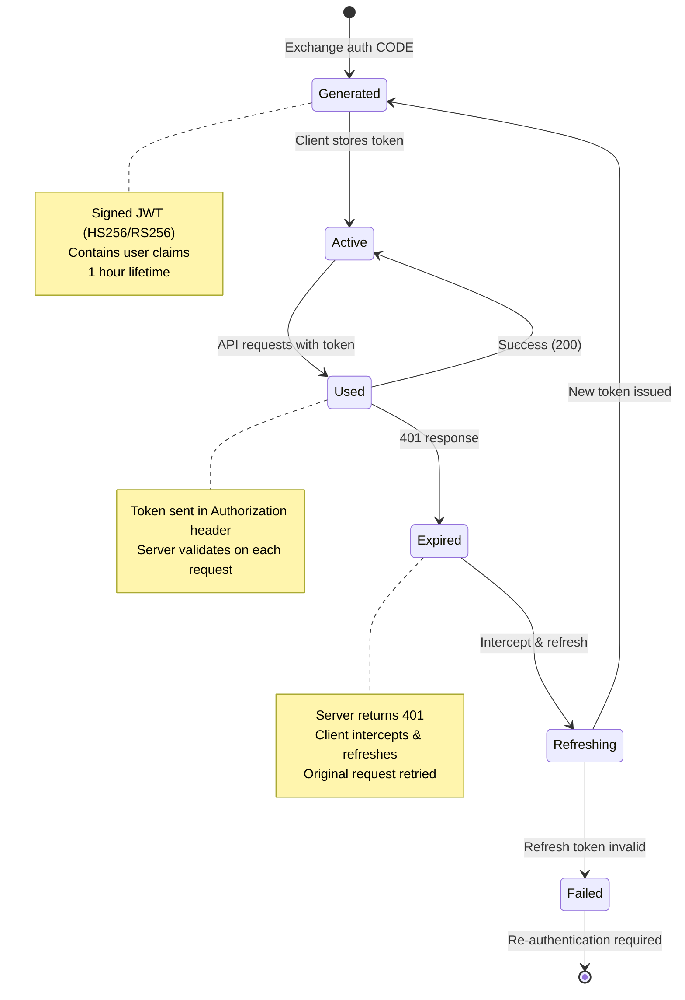
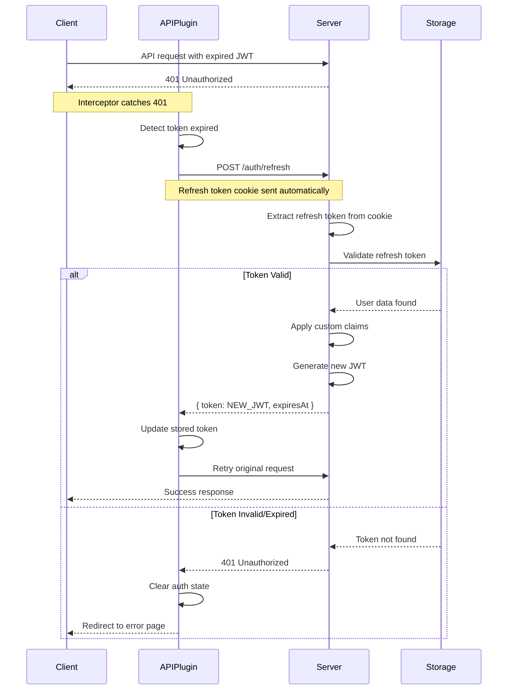
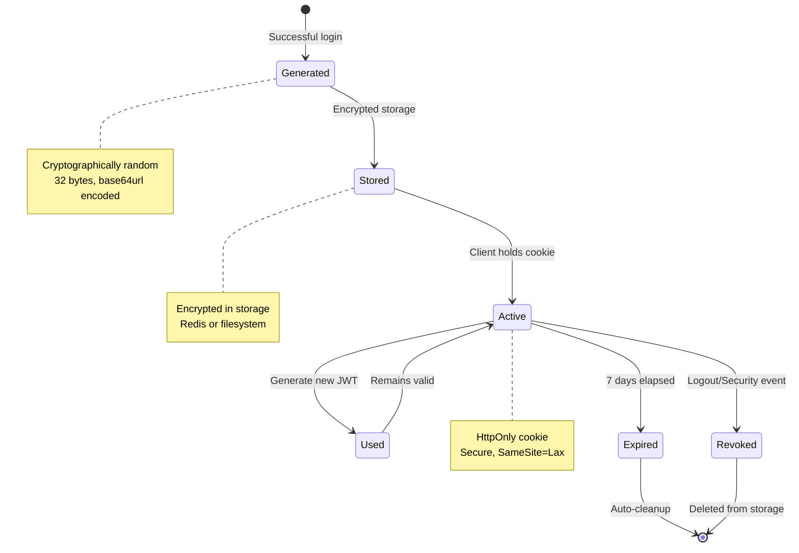

# Token Lifecycle

Complete lifecycle of tokens from generation through refresh to expiration.

## Overview

Nuxt Aegis manages multiple types of tokens throughout the authentication process. Each token type has a specific purpose, lifetime, and security model. This page details the complete lifecycle of each token type.

## Token Types Overview



## Token Lifecycle Stages

### 1. Authorization CODE Lifecycle



**Generation**
```typescript
function generateAuthCode(): string {
  return randomBytes(32).toString('base64url')
}

const code = generateAuthCode()
await authCodeStore.setItem(`authcode:${code}`, {
  user: enrichedUserData,
  provider: 'google',
  createdAt: Date.now(),
}, { ttl: 60 }) // 60 second lifetime
```

**Exchange**
```typescript
// Client exchanges CODE for JWT
const codeData = await authCodeStore.getItem(`authcode:${code}`)

if (!codeData) {
  throw createError({ 
    statusCode: 401, 
    message: 'Invalid or expired authorization CODE' 
  })
}

// Immediately delete (single-use)
await authCodeStore.removeItem(`authcode:${code}`)

// Generate JWT from CODE data
const jwt = await generateJWT(codeData.user)
```

**Expiration**
- **Lifetime**: 60 seconds (configurable)
- **Cleanup**: Automatic via TTL
- **Purpose**: Prevent token exposure in redirects

### 2. JWT Access Token Lifecycle



**Generation**
```typescript
function generateJWT(user: UserInfo, customClaims?: Record<string, unknown>): string {
  const payload = {
    sub: user.sub,
    email: user.email,
    name: user.name,
    picture: user.picture,
    ...customClaims,
    iat: Math.floor(Date.now() / 1000),
    exp: Math.floor(Date.now() / 1000) + 3600, // 1 hour
    iss: 'nuxt-aegis',
  }
  
  return sign(payload, jwtSecret, { algorithm: 'HS256' })
}
```

**Validation**
```typescript
export async function validateJWT(token: string): Promise<JWTPayload> {
  try {
    const payload = await verify(token, jwtSecret, {
      algorithms: ['HS256'],
    })
    
    // Check expiration
    if (payload.exp && payload.exp * 1000 < Date.now()) {
      throw new Error('Token expired')
    }
    
    return payload
  } catch (error) {
    throw createError({ statusCode: 401, message: 'Invalid token' })
  }
}
```

**Token Structure**
```json
{
  "header": {
    "alg": "HS256",
    "typ": "JWT"
  },
  "payload": {
    "sub": "google|123456789",
    "email": "user@example.com",
    "name": "John Doe",
    "picture": "https://...",
    "role": "admin",
    "permissions": ["read", "write"],
    "iat": 1703001600,
    "exp": 1703005200,
    "iss": "nuxt-aegis"
  },
  "signature": "..."
}
```

**Refresh Flow (On-Demand)**


**Configuration**
```typescript
export default defineNuxtConfig({
  nuxtAegis: {
    jwt: {
      expiresIn: 3600, // 1 hour (seconds)
      algorithm: 'HS256', // or 'RS256'
      secret: process.env.NUXT_AEGIS_JWT_SECRET,
    },
  },
})
```

### 3. Refresh Token Lifecycle



**Generation & Storage**
```typescript
function generateRefreshToken(): string {
  return randomBytes(32).toString('base64url')
}

async function storeRefreshToken(token: string, user: UserInfo) {
  const storage = useStorage('refreshTokens')
  
  await storage.setItem(`refresh:${token}`, {
    user: user,
    createdAt: Date.now(),
    lastUsedAt: Date.now(),
  }, {
    ttl: 604800, // 7 days in seconds
  })
}

// Set as HttpOnly cookie
setCookie(event, 'aegis_refresh', token, {
  httpOnly: true,
  secure: true,
  sameSite: 'lax',
  maxAge: 604800, // 7 days in seconds
  path: '/',
})
```

**Usage & Refresh**
```typescript
export default defineEventHandler(async (event) => {
  // Extract refresh token from cookie
  const refreshToken = getCookie(event, 'aegis_refresh')
  
  if (!refreshToken) {
    throw createError({ statusCode: 401, message: 'No refresh token' })
  }
  
  // Validate and retrieve user data
  const storage = useStorage('refreshTokens')
  const tokenData = await storage.getItem(`refresh:${refreshToken}`)
  
  if (!tokenData) {
    throw createError({ statusCode: 401, message: 'Invalid refresh token' })
  }
  
  // Update last used timestamp
  await storage.setItem(`refresh:${refreshToken}`, {
    ...tokenData,
    lastUsedAt: Date.now(),
  }, { ttl: 604800 })
  
  // Generate new JWT
  const customClaims = await resolveCustomClaims(tokenData.user)
  const jwt = generateJWT(tokenData.user, customClaims)
  
  return {
    token: jwt,
    expiresAt: Date.now() + 3600000, // 1 hour
  }
})
```

**Revocation (Logout)**
```typescript
export default defineEventHandler(async (event) => {
  const refreshToken = getCookie(event, 'aegis_refresh')
  
  if (refreshToken) {
    const storage = useStorage('refreshTokens')
    
    // Delete refresh token from storage
    await storage.removeItem(`refresh:${refreshToken}`)
    
    // Clear cookie
    deleteCookie(event, 'aegis_refresh')
  }
  
  return { success: true }
})
```

**Storage Configuration**
```typescript
export default defineNuxtConfig({
  nitro: {
    storage: {
      refreshTokens: {
        driver: 'redis', // or 'fs', 'memory'
        host: process.env.REDIS_HOST,
        port: process.env.REDIS_PORT,
        password: process.env.REDIS_PASSWORD,
        db: 0,
      },
    },
  },
  
  nuxtAegis: {
    refreshToken: {
      expiresIn: 604800, // 7 days (seconds)
      cookieName: 'aegis_refresh',
    },
  },
})
```

## Token Comparison

| Feature | Authorization CODE | JWT Access Token | Refresh Token |
|---------|-------------------|------------------|---------------|
| **Lifetime** | 60 seconds | 1 hour | 7 days |
| **Storage** | Memory (server) | Client (memory) | Server + Cookie |
| **Purpose** | Exchange for tokens | API authentication | Generate new JWTs |
| **Security** | Single-use, random | Signed, short-lived | HttpOnly, encrypted |
| **Transmission** | URL parameter | Authorization header | Cookie |
| **Revocable** | Auto-expires | No (stateless) | Yes (storage deletion) |
| **Size** | ~44 bytes | ~200-500 bytes | ~44 bytes |

## Cleanup & Maintenance

### Automatic Cleanup with Nitro Tasks

Nuxt Aegis uses Nitro's scheduled tasks feature to automatically clean up expired tokens. These tasks run daily at 2:00 AM by default, and can be configured.

**Refresh Token Cleanup Task**
```typescript
// src/runtime/tasks/cleanup/refresh-tokens.ts
import { defineTask, useStorage } from 'nitropack/runtime'

export default defineTask({
  meta: {
    name: 'cleanup:refresh-tokens',
    description: 'Clean up expired and revoked refresh tokens from storage',
  },
  async run() {
    const storage = useStorage('refreshTokenStore')
    const keys = await storage.getKeys()
    const now = Date.now()
    
    let deletedCount = 0
    let revokedCount = 0
    let expiredCount = 0
    
    for (const tokenHash of keys) {
      const data = await getRefreshTokenData(tokenHash)
      
      if (!data) continue
      
      // Check if token is expired or revoked
      if (data.expiresAt < now || data.isRevoked) {
        await storage.removeItem(tokenHash)
        deletedCount++
        
        if (data.isRevoked) {
          revokedCount++
        } else {
          expiredCount++
        }
      }
    }
    
    return {
      result: {
        deleted: deletedCount,
        expired: expiredCount,
        revoked: revokedCount,
      },
    }
  },
})
```

**Task Schedule Configuration**
```typescript
// src/module.ts
export default defineNuxtModule({
  setup(options, nuxt) {
    // Enable Nitro tasks feature
    nuxt.options.nitro.experimental.tasks = true
    
    // Schedule cleanup tasks daily at 2:00 AM
    nuxt.options.nitro.scheduledTasks = {
      '0 2 * * *': [
        'cleanup:refresh-tokens',
        'cleanup:magic-codes',
        'cleanup:reset-sessions',
      ],
    }
  },
})
```

**Custom Schedule**
```typescript
// nuxt.config.ts - Override default schedule
export default defineNuxtConfig({
  nitro: {
    scheduledTasks: {
      // Run cleanup every 6 hours
      '0 */6 * * *': [
        'cleanup:refresh-tokens',
        'cleanup:magic-codes',
        'cleanup:reset-sessions',
      ],
    },
  },
})
```

**Manual Cleanup**
```typescript
// Trigger cleanup manually via API
export default defineEventHandler(async (event) => {
  const result = await runTask('cleanup:refresh-tokens')
  return result
})
```

### Token Revocation

**Revoke Single Token (Logout)**
```typescript
export default defineEventHandler(async (event) => {
  const refreshToken = getCookie(event, 'aegis_refresh')
  
  if (refreshToken) {
    await revokeRefreshToken(refreshToken)
    deleteCookie(event, 'aegis_refresh')
  }
  
  return { success: true }
})
```

**Revoke All User Tokens**
```typescript
// Revoke all tokens for a user (e.g., password change, security event)
export async function revokeAllUserTokens(userId: string) {
  const storage = useStorage('refreshTokenStore')
  const keys = await storage.getKeys()
  
  for (const key of keys) {
    const data = await getRefreshTokenData(key)
    
    if (data && data.user.sub === userId) {
      await storage.removeItem(key)
    }
  }
}
```

## Next Steps

- [Authentication Flow](/architecture/authentication-flow) - Complete authentication process
- [Project Structure](/architecture/project-structure) - Codebase organization
- [Token Refresh Guide](/guides/token-refresh) - Implementing token refresh
