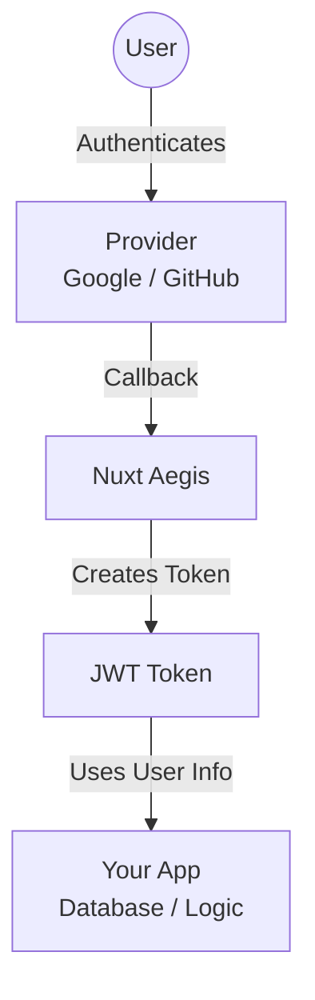

# Why nuxt-aegis?

Nuxt Aegis takes a different approach to authentication compared to other Nuxt auth modules, offering several key advantages for modern application development.

## Understanding the Architecture

Before diving into the benefits, it's important to understand how the pieces fit together:

### The Three-Layer Model

1. **Authentication Providers** (Google, GitHub, Auth0, etc.)
   - External services that verify user identity
   - Handle the actual authentication process (username/password, OAuth, MFA, etc.)
   - Return user information once authentication succeeds

2. **Nuxt Aegis Module** (this module)
   - **Orchestrates** the authentication flow with providers
   - **Creates JWT tokens** representing the authenticated user
   - **Manages token lifecycle** (storage, refresh, validation)
   - **Provides the framework** for integrating auth into your application

3. **Your Application Logic**
   - Uses the authenticated user information in your backend
   - **Integrates with your database** or persistent storage
   - Implements your business logic and authorization rules
   - Manages user profiles, roles, and permissions

### How It Works Together

**The flow:**
1. User clicks "Login with Google" in your app
2. **Provider** (Google) authenticates the user
3. **Nuxt Aegis** receives confirmation and creates a JWT token
4. **Your backend** receives this JWT token with all authenticated requests
5. **Your app** can extract user info from the token and integrate with your database

This separation of concerns means Nuxt Aegis focuses on **authentication orchestration and token management**, while giving you full control over **user data persistence and authorization** in your application.

## Industry-Standard JWT Bearer Tokens

Unlike cookie-based authentication solutions, Nuxt Aegis uses **industry-standard JWT bearer tokens** to carry information about the logged-in user. This fundamental architectural choice provides significant benefits:

- **Universal Access**: Your API can be accessed from multiple client types using the same authentication mechanism
- **Multi-Platform Support**: Works seamlessly with web applications, mobile apps, CLI tools, and other clients
- **Standard Compliance**: Follows OAuth 2.0 and OpenID Connect specifications

With cookie-based authentication, your API is essentially locked to browser-only access. JWT bearer tokens remove this limitation.

## Built-in Token Refresh

Nuxt Aegis includes **automatic token refresh** out of the box:

- Transparent refresh token handling without user intervention
- Configurable refresh strategies to suit your security requirements
- Graceful handling of expired sessions
- Support for both short-lived access tokens and long-lived refresh tokens

No need to implement complex refresh logic yourself or worry about session expiration edge cases.

## Security by Design

Security is a first-class concern in Nuxt Aegis:

- **Secure token storage** with encryption support
- **Token encryption** at rest
- **Secure HTTP-only cookie options** for refresh tokens when needed

## Extensible Architecture

Nuxt Aegis is designed for real-world applications that need database integration and custom logic:

- **Multiple integration points** for custom business logic
- **Event hooks** for authentication lifecycle events (login, logout, token refresh)
- **Custom claims** support to enrich tokens with your application's user data
- **Database integration** hooks to persist user information in your storage
- **Custom provider** support for any OAuth 2.0 / OpenID Connect provider
- **Middleware extensibility** for route protection and authorization

### Integration with Your Application

Nuxt Aegis provides the authentication framework while giving you complete control over user data:

- **On user login**: Hook into the authentication event to create/update user records in your database
- **Token creation**: Add custom claims from your database (roles, permissions, preferences)
- **Every request**: Extract user info from JWT tokens to power your application logic
- **Your choice of storage**: SQL, NoSQL, ORM - integrate with any persistence layer

The module handles authentication; you handle your application's user management.

## Testable Out of the Box

Testing authentication flows can be challenging, but Nuxt Aegis makes it straightforward:

- **Mock provider** included for testing without external dependencies
- **No cookie complications** in test environments
- **Predictable token-based flows** that are easy to simulate
- **Unit test friendly** composables and utilities
- **Integration test support** with the included mock provider

Cookie-based authentication is notoriously difficult to test properly, requiring complex setup or external services. With bearer tokens and the supplied mock provider, you can write reliable tests with minimal effort.

## When to Choose Nuxt Aegis

Nuxt Aegis is ideal when you need:

- **API-first architecture** where multiple clients need to authenticate
- **Modern authentication** following OAuth 2.0 / OpenID Connect standards
- **Testable authentication** without complicated setup
- **Flexible integration** with your database and business logic
- **Non-browser clients** like mobile apps or CLI tools

## Comparison with Cookie-Based Solutions

| Feature | Nuxt Aegis (JWT Bearer) | Cookie-Based Auth |
|---------|------------------------|-------------------|
| Multi-client support | ✅ Native | ❌ Browser only |
| API access from CLI/mobile | ✅ Yes | ❌ Not possible |
| Testing complexity | ✅ Simple | ⚠️ Complex |
| Token refresh | ✅ Built-in | ⚠️ Session-based |
| Standard compliance | ✅ OAuth 2.0/OIDC | ⚠️ Varies |
| Database integration | ✅ Flexible hooks | ⚠️ Varies |

## Next Steps

Ready to get started? Check out the [Installation](/getting-started/installation) guide to add Nuxt Aegis to your project.
