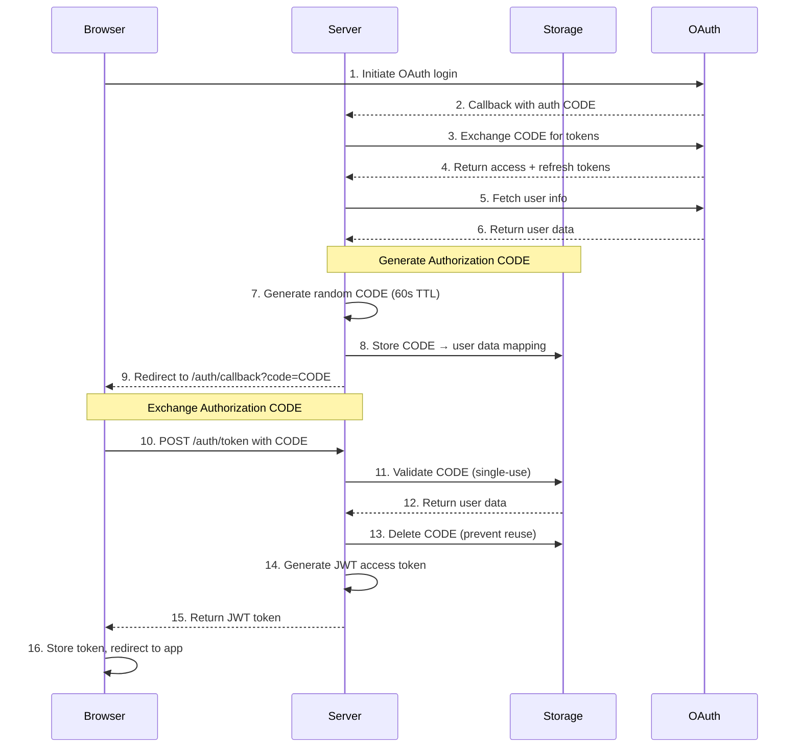
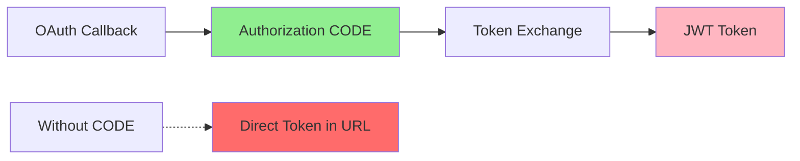

# Authorization CODE Flow

An additional security layer with short-lived authorization CODEs between OAuth callback and token exchange.

## Overview

Nuxt Aegis implements an authorization CODE flow to prevent token exposure in browser redirects. This adds a security layer where tokens never appear in URLs or browser history.

## How It Works



**The flow:**

1. **OAuth Provider** → Server receives auth CODE
2. Server exchanges CODE for provider tokens
3. Server retrieves user info
4. **Server generates authorization CODE** (60s lifetime)
5. Server stores CODE with user data in memory
6. Server redirects to `/auth/callback?code=CODE`
7. **Client calls** `/auth/token` **with CODE**
8. Server validates CODE (single-use)
9. Server generates JWT tokens
10. Server returns access token to client

## Configuration

```typescript
export default defineNuxtConfig({
  nuxtAegis: {
    authCode: {
      expiresIn: 60, // CODE lifetime in seconds (default: 60)
    },
  },
})
```

## Security Features

### Short-Lived

Authorization CODEs expire quickly (60 seconds by default):

```typescript
export default defineNuxtConfig({
  nuxtAegis: {
    authCode: {
      expiresIn: 60, // Adjust as needed (30-120 seconds recommended)
    },
  },
})
```

::: tip Expiration Balance
- **Too short** (< 30s): May cause issues on slow connections
- **Too long** (> 120s): Increases attack window
- **Recommended**: 60 seconds (default)
:::

### Single-Use

Each CODE is deleted immediately after exchange:

```typescript
// server/utils/authCodeStore.ts
export async function exchangeAuthCode(code: string) {
  const storage = useStorage('authCodeStore')
  
  // Get CODE data
  const data = await storage.getItem(`authcode:${code}`)
  
  if (!data) {
    throw createError({ statusCode: 401, message: 'Invalid or expired CODE' })
  }
  
  // Delete CODE immediately (single-use)
  await storage.removeItem(`authcode:${code}`)
  
  return data
}
```

::: danger Single-Use Enforcement
CODEs cannot be reused. Attempting to exchange the same CODE twice will result in a 401 error.
:::

### Cryptographically Secure

CODEs are generated using `crypto.randomBytes(32)`:

```typescript
import { randomBytes } from 'crypto'

function generateAuthCode(): string {
  return randomBytes(32).toString('base64url')
}
```

### Memory Storage

CODEs are stored in memory (not persisted to disk):

```typescript
export default defineNuxtConfig({
  nitro: {
    storage: {
      authCodeStore: {
        driver: 'memory', // In-memory only
      },
    },
  },
})
```

::: info Non-Persistent
Authorization CODEs are intentionally NOT persisted. If the server restarts during the OAuth flow, users simply retry the login.
:::

### Automatic Cleanup

Expired CODEs are automatically removed from memory:

```typescript
// server/utils/authCodeStore.ts
export async function cleanupExpiredCodes() {
  const storage = useStorage('authCodeStore')
  const keys = await storage.getKeys('authcode:')
  
  for (const key of keys) {
    const data = await storage.getItem(key)
    
    if (data && Date.now() > data.expiresAt) {
      await storage.removeItem(key)
    }
  }
}
```

## Why Use This Approach?

### Prevents URL Token Exposure

**Without authorization CODE:**
```
https://myapp.com/auth/callback?access_token=eyJhbGciOiJIUzI1NiIsInR5cCI6IkpXVCJ9...
```

❌ Token visible in browser history  
❌ Token visible in server logs  
❌ Token visible in referer headers

**With authorization CODE:**
```
https://myapp.com/auth/callback?code=random_short_lived_code
```

✅ Token never appears in URL  
✅ CODE expires quickly (60s)  
✅ CODE is single-use only

### Reduced Attack Surface

- **Short lifetime**: CODEs expire in 60 seconds
- **Single-use**: CODEs can't be replayed
- **Server-side validation**: Client can't forge CODEs
- **No token leakage**: Tokens only travel in HTTP bodies (POST requests)

### Better Security



**With CODE (Secure):**
- CODE in URL (short-lived, single-use)
- Token in POST body (never in URL)

**Without CODE (Less Secure):**
- Token directly in URL (permanent in history)

### Single-Use Enforcement

```typescript
// First exchange - SUCCESS
await $fetch('/auth/token', {
  method: 'POST',
  body: { code: 'abc123' }
})
// Returns: { token: 'jwt-token' }

// Second exchange with same CODE - FAILURE
await $fetch('/auth/token', {
  method: 'POST',
  body: { code: 'abc123' }
})
// Throws: 401 Invalid or expired CODE
```

## Implementation Details

### Generating CODEs

```typescript
// server/utils/authCode.ts
import { randomBytes } from 'crypto'

export function generateAuthCode(): string {
  return randomBytes(32).toString('base64url')
}

export async function storeAuthCode(
  code: string,
  userData: Record<string, unknown>,
  expiresIn: number = 60
) {
  const storage = useStorage('authCodeStore')
  
  await storage.setItem(`authcode:${code}`, {
    user: userData,
    expiresAt: Date.now() + (expiresIn * 1000),
  })
}
```

### Exchanging CODEs

```typescript
// server/routes/auth/token.post.ts
export default defineEventHandler(async (event) => {
  const { code } = await readBody(event)
  
  if (!code) {
    throw createError({ statusCode: 400, message: 'CODE required' })
  }
  
  // Exchange CODE for user data (single-use)
  const data = await exchangeAuthCode(code)
  
  // Generate JWT access token
  const token = await generateAccessToken(data.user)
  
  return { token }
})
```

### Error Handling

```vue
<script setup lang="ts">
const route = useRoute()

onMounted(async () => {
  const code = route.query.code
  
  if (!code) {
    console.error('No authorization CODE in URL')
    await navigateTo('/login')
    return
  }
  
  try {
    const { token } = await $fetch('/auth/token', {
      method: 'POST',
      body: { code }
    })
    
    // Store token and redirect
    await saveToken(token)
    await navigateTo('/dashboard')
  } catch (error) {
    if (error.statusCode === 401) {
      // CODE expired or invalid
      console.error('Authorization CODE expired')
      await navigateTo('/login')
    } else {
      console.error('Token exchange failed:', error)
    }
  }
})
</script>
```

## Testing Authorization CODE Flow

```typescript
import { describe, it, expect } from 'vitest'
import { $fetch } from '@nuxt/test-utils'

describe('Authorization CODE Flow', () => {
  it('should exchange valid CODE for token', async () => {
    // Generate mock CODE
    const code = await generateMockAuthCode()
    
    // Exchange CODE
    const response = await $fetch('/auth/token', {
      method: 'POST',
      body: { code }
    })
    
    expect(response.token).toBeDefined()
  })
  
  it('should reject expired CODEs', async () => {
    const code = await generateExpiredAuthCode()
    
    await expect($fetch('/auth/token', {
      method: 'POST',
      body: { code }
    })).rejects.toThrow('401')
  })
  
  it('should reject reused CODEs', async () => {
    const code = await generateMockAuthCode()
    
    // First exchange - success
    await $fetch('/auth/token', {
      method: 'POST',
      body: { code }
    })
    
    // Second exchange - should fail
    await expect($fetch('/auth/token', {
      method: 'POST',
      body: { code }
    })).rejects.toThrow('401')
  })
})
```

## Best Practices

::: tip Recommendations
1. **Keep expiration short** - 60 seconds is a good balance
2. **Enforce single-use** - Delete CODEs immediately after exchange
3. **Use memory storage** - CODEs don't need persistence
4. **Generate securely** - Use `crypto.randomBytes(32)`
5. **Clean up expired CODEs** - Prevent memory leaks
6. **Handle errors gracefully** - Redirect to login on CODE expiration
7. **Never log CODEs** - Treat like passwords
:::

::: warning Common Pitfalls
- Don't store CODEs in persistent storage (use memory)
- Don't extend expiration beyond 2 minutes
- Don't allow CODE reuse (delete after exchange)
- Don't expose CODEs in error messages or logs
:::

## Next Steps

- [Learn about token refresh](/guides/token-refresh)
- [Configure storage backends](/configuration/storage)
- [Review security best practices](/security/best-practices)
