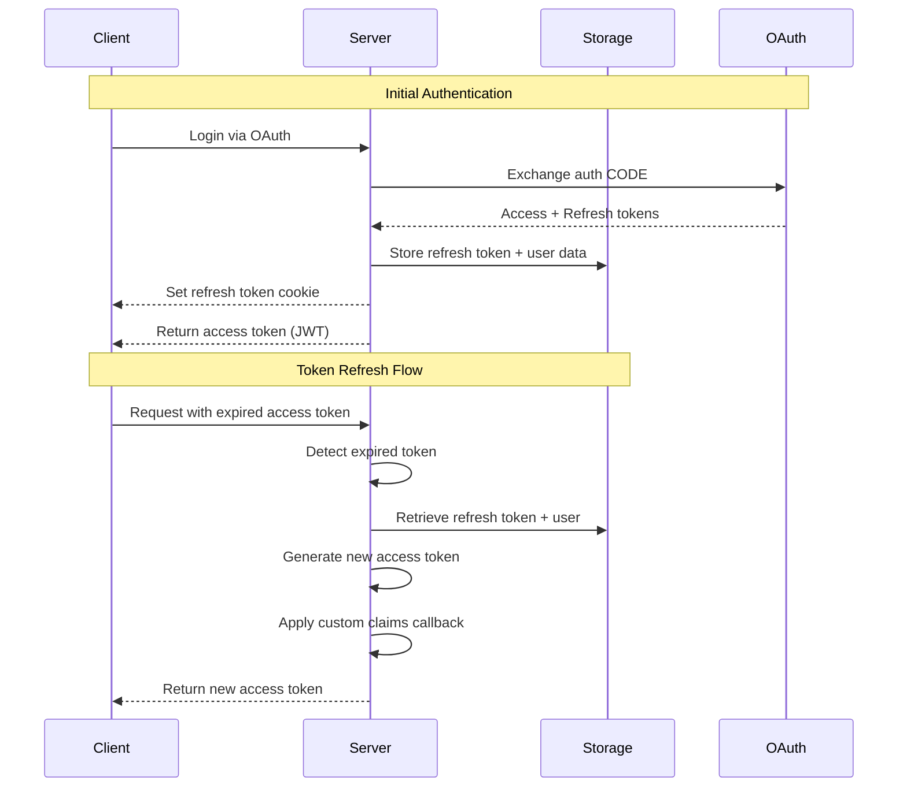

# Token Refresh

Maintain user sessions without re-authentication using automatic token refresh.

## Overview

Nuxt Aegis provides automatic token refresh functionality that:
- Refreshes access tokens transparently
- Stores refresh tokens securely server-side
- Handles token expiration gracefully
- Supports optional encryption at rest

## How Token Refresh Works



**The refresh flow:**

1. **Initial Authentication** - After OAuth login, refresh token is stored server-side with complete user data
2. **Auto-Refresh on Startup** - When app initializes with a valid refresh token cookie, it automatically gets a new access token
3. **Expiration Handling** - When access token expires, client requests a new one using the refresh token cookie
4. **Token Generation** - Server retrieves stored user object and regenerates access token with the same custom claims
5. **Optional Rotation** - Server can rotate (replace) the refresh token for additional security

## Configuration

### Basic Setup

```typescript
export default defineNuxtConfig({
  nuxtAegis: {
    tokenRefresh: {
      enabled: true,
      automaticRefresh: true, // Refresh on app startup
      cookie: {
        cookieName: 'nuxt-aegis-refresh',
        maxAge: 60 * 60 * 24 * 7, // 7 days
        secure: true,
        httpOnly: true,
        sameSite: 'lax',
      },
    },
  },
})
```

### Complete Configuration

```typescript
export default defineNuxtConfig({
  nuxtAegis: {
    tokenRefresh: {
      enabled: true,
      automaticRefresh: true,
      
      // Cookie configuration
      cookie: {
        cookieName: 'nuxt-aegis-refresh',
        maxAge: 60 * 60 * 24 * 7,   // 7 days in seconds
        secure: true,                // HTTPS only
        httpOnly: true,              // Not accessible to JavaScript
        sameSite: 'lax',             // CSRF protection
        path: '/',
      },
      
      // Persistent storage
      storage: {
        driver: 'redis',             // 'fs', 'redis', or 'memory'
        prefix: 'refresh:',
        base: './.data/refresh-tokens',
      },
      
      // Encryption at rest
      encryption: {
        enabled: true,
        key: process.env.NUXT_AEGIS_ENCRYPTION_KEY!,
        algorithm: 'aes-256-gcm',
      },
    },
  },
})
```

## Automatic Refresh

When `automaticRefresh: true`, the module automatically:

1. Attempts to refresh access token when app initializes (if refresh token cookie exists)
2. Handles access token expiration gracefully
3. Refreshes tokens when they have expired (if refresh token is still valid)
4. Retries failed API requests after token refresh
5. Prevents multiple simultaneous refresh requests

::: tip Seamless Experience
With automatic refresh enabled, users remain authenticated across page reloads and browser sessions without re-login.
:::

## Refresh Token Storage

Refresh tokens are stored server-side in a **persistent storage layer** that survives server restarts.

### What's Stored

Each refresh token entry includes:

- **Hashed token value** (SHA-256 hash used as storage key)
- **Complete user object** (all profile data from OAuth provider)
- **Subject identifier** (`sub`)
- **Expiration timestamp**
- **Revocation status** (for logout/invalidation)
- **Optional encrypted data** (if encryption enabled)

### Storage Drivers

::: code-group

```typescript [Filesystem (Development)]
export default defineNuxtConfig({
  nuxtAegis: {
    tokenRefresh: {
      storage: {
        driver: 'fs',
        base: './.data/refresh-tokens',
        prefix: 'refresh:',
      },
    },
  },
  nitro: {
    storage: {
      refreshTokenStore: {
        driver: 'fs',
        base: './.data/refresh-tokens',
      },
    },
  },
})
```

```typescript [Redis (Production)]
export default defineNuxtConfig({
  nuxtAegis: {
    tokenRefresh: {
      storage: {
        driver: 'redis',
        prefix: 'refresh:',
      },
    },
  },
  nitro: {
    storage: {
      refreshTokenStore: {
        driver: 'redis',
        host: process.env.REDIS_HOST || 'localhost',
        port: parseInt(process.env.REDIS_PORT || '6379'),
        password: process.env.REDIS_PASSWORD,
        db: 0,
      },
    },
  },
})
```

```typescript [Memory (Testing Only)]
export default defineNuxtConfig({
  nuxtAegis: {
    tokenRefresh: {
      storage: {
        driver: 'memory',
      },
    },
  },
  nitro: {
    storage: {
      refreshTokenStore: {
        driver: 'memory',
      },
    },
  },
})
```

:::

::: danger Production Storage
Never use `memory` or `fs` drivers in production. Use Redis or a database for scalable, persistent storage.
:::

## Encryption at Rest

Enable AES-256-GCM encryption for sensitive user data stored with refresh tokens.

### Configuration

```typescript
export default defineNuxtConfig({
  nuxtAegis: {
    tokenRefresh: {
      encryption: {
        enabled: true,
        key: process.env.NUXT_AEGIS_ENCRYPTION_KEY!,
        algorithm: 'aes-256-gcm',
      },
    },
  },
})
```

### Generate Encryption Key

```bash
# Generate a 32-character encryption key
openssl rand -base64 32
```

Add to `.env`:

```bash
NUXT_AEGIS_ENCRYPTION_KEY=your-generated-32-character-key-here
```

### Security Features

- **AES-256-GCM** authenticated encryption
- **Random IV** (initialization vector) for each encryption
- **Transparent operation** (automatic encrypt/decrypt)
- **Storage protection** (protects against storage backend compromise)
- **Authentication tags** (prevents tampering)

### When to Use Encryption

- ✅ When storing sensitive user data (emails, names, etc.)
- ✅ When using shared storage backends (e.g., Redis)
- ✅ When compliance requires encryption at rest
- ✅ When storage backend is not fully trusted

::: tip Performance Impact
Encryption adds minimal CPU overhead (~2-5ms per operation) but significantly improves security.
:::

## Manual Refresh

You can manually refresh tokens using the `useAuth` composable:

```vue
<script setup lang="ts">
const { refresh, user, isAuthenticated } = useAuth()

async function refreshToken() {
  try {
    await refresh()
    console.log('Token refreshed successfully')
    console.log('User:', user.value)
  } catch (error) {
    console.error('Token refresh failed:', error)
    // Redirect to login or show error
  }
}
</script>

<template>
  <div>
    <button v-if="isAuthenticated" @click="refreshToken">
      Refresh Token
    </button>
  </div>
</template>
```

::: info Automatic vs Manual
Manual refresh is rarely needed when `automaticRefresh: true` is configured. The module handles refresh automatically.
:::

## Custom Claims on Refresh

When tokens are refreshed, the custom claims callback is invoked again:

```typescript
// server/routes/auth/google.get.ts
export default defineOAuthGoogleEventHandler({
  customClaims: async (user, tokens) => {
    // This runs on BOTH initial login AND token refresh
    const userRole = await db.getUserRole(user.email)
    
    return {
      role: userRole,
      premium: await checkPremiumStatus(user.email),
    }
  },
})
```

::: warning Provider Tokens Unavailable
During token refresh, the OAuth provider's tokens are NOT available since we're not re-authenticating. Only the stored user object is passed to the callback.
:::

## Token Rotation

For additional security, you can rotate refresh tokens:

```typescript
// server/utils/rotateRefreshToken.ts
export async function rotateRefreshToken(
  event: H3Event,
  oldToken: string
) {
  // Generate new refresh token
  const newToken = generateRefreshToken()
  
  // Get stored user data
  const userData = await getStoredUserData(oldToken)
  
  // Delete old token
  await deleteRefreshToken(oldToken)
  
  // Store new token with same user data
  await storeRefreshToken(newToken, userData)
  
  // Set new cookie
  setRefreshTokenCookie(event, newToken)
  
  return newToken
}
```

## Logout and Token Revocation

When users log out, refresh tokens are revoked:

```typescript
const { logout } = useAuth()

// Logout (revokes refresh token)
await logout()
```

Server-side logout implementation:

```typescript
// server/routes/logout.post.ts
export default defineEventHandler(async (event) => {
  // Get refresh token from cookie
  const refreshToken = getCookie(event, 'nuxt-aegis-refresh')
  
  if (refreshToken) {
    // Delete from storage
    const storage = useStorage('refreshTokenStore')
    await storage.removeItem(`refresh:${refreshToken}`)
    
    // Delete cookie
    deleteCookie(event, 'nuxt-aegis-refresh')
  }
  
  return { success: true }
})
```

## Testing Token Refresh

Test refresh functionality in your test suite:

```typescript
import { describe, it, expect } from 'vitest'
import { $fetch } from '@nuxt/test-utils'

describe('Token Refresh', () => {
  it('should refresh expired tokens', async () => {
    // Authenticate and get tokens
    const { accessToken, refreshToken } = await authenticate()
    
    // Wait for access token to expire
    await waitForExpiration(accessToken)
    
    // Request refresh
    const response = await $fetch('/auth/refresh', {
      headers: {
        Cookie: `nuxt-aegis-refresh=${refreshToken}`
      }
    })
    
    expect(response.token).toBeDefined()
    expect(response.token).not.toBe(accessToken)
  })
  
  it('should reject invalid refresh tokens', async () => {
    await expect($fetch('/auth/refresh', {
      headers: {
        Cookie: 'nuxt-aegis-refresh=invalid-token'
      }
    })).rejects.toThrow('401')
  })
})
```

## Monitoring and Debugging

Log refresh events for monitoring:

```typescript
// server/plugins/aegis.ts
export default defineNitroPlugin((nitroApp) => {
  nitroApp.hooks.hook('nuxt-aegis:token-refreshed', async (payload) => {
    console.log('[REFRESH] Token refreshed', {
      userId: payload.user.sub,
      timestamp: new Date().toISOString(),
    })
    
    // Send to monitoring service
    await monitoring.track('token_refresh', {
      userId: payload.user.sub,
    })
  })
})
```

## Best Practices

::: tip Recommendations
1. **Use automatic refresh** - Enable `automaticRefresh: true` for seamless UX
2. **Use Redis in production** - Don't rely on filesystem storage
3. **Enable encryption** - Protect sensitive user data at rest
4. **Set appropriate TTL** - Balance security and convenience (7 days is common)
5. **Rotate tokens** - Consider rotating refresh tokens periodically
6. **Monitor refresh events** - Track refresh failures for security
7. **Handle expiration gracefully** - Redirect to login when refresh fails
8. **Use HTTPS** - Always set `secure: true` in production
:::

::: warning Common Pitfalls
- Don't store refresh tokens client-side (use httpOnly cookies)
- Don't use memory storage in production
- Don't forget to clean up expired tokens
- Don't expose refresh tokens in logs or error messages
- Don't rely on refresh tokens lasting forever (they expire)
:::

## Next Steps

- [Configure storage backends](/configuration/storage)
- [Learn about authorization CODE flow](/guides/authorization-code)
- [Review security best practices](/security/best-practices)
