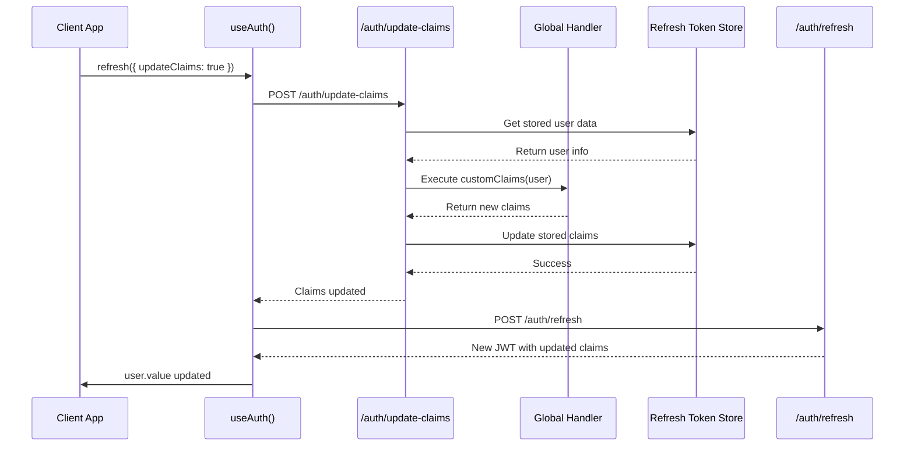

# Updating JWT Claims

Update JWT claims when user data changes without requiring logout/re-login.

## Overview

When user data changes (role, permissions, subscription status, etc.), you may need to update the JWT claims to reflect the current state. Nuxt Aegis supports this via `refresh({ updateClaims: true })`, which recomputes claims using your global handler's `customClaims` callback before issuing a new JWT.

## The Problem

By design, `refresh()` reuses custom claims that were stored during initial authentication:

- ✅ **Fast refresh** - No database queries needed
- ✅ **Consistent claims** - Claims don't change unexpectedly- ❌ **Stale data** - Claims don't update when user data changes

If a user's role, permissions, or other claim data changes in your database, calling `refresh()` will **not** pick up these changes automatically.

## The Solution: `refresh({ updateClaims: true })`

Nuxt Aegis supports recomputing claims as part of the refresh flow:

```vue
<script setup lang="ts">
const { refresh, user } = useAuth()

async function promoteToAdmin() {
  // Update user in database
  await $api('/api/admin/promote-user', {
    method: 'POST',
    body: { userId: user.value?.sub }
  })
  
  // Refresh with updated claims
  await refresh({ updateClaims: true })
  
  // user.value.role is now 'admin'!
}
</script>

<template>
  <div>
    <p>Current role: {{ user?.role }}</p>
    <button @click="promoteToAdmin">Promote to Admin</button>
  </div>
</template>
```

## How It Works

When you call `refresh({ updateClaims: true })`:

1. **Recompute claims** - Calls `/auth/update-claims` endpoint
2. **Re-executes handler** - Runs your global handler's `customClaims` callback
3. **Updates storage** - Stores new claims in refresh token data
4. **Refresh** - Calls `/auth/refresh` to get new JWT with updated claims
5. **Updates state** - Client state updates with new user data



## Configuration

### Enable/Disable Feature

Claims update is enabled by default but can be disabled:

```typescript
export default defineNuxtConfig({
  nuxtAegis: {
    tokenRefresh: {
      enableClaimsUpdate: true, // Default: true
    },
  },
})
```

### Recompute User Data

Optionally re-execute `onUserPersist` to fetch fresh database data:

```typescript
export default defineNuxtConfig({
  nuxtAegis: {
    tokenRefresh: {
      enableClaimsUpdate: true,
      recomputeOnUserPersist: true, // Default: false
    },
  },
})
```

::: info Performance Consideration
When `recomputeOnUserPersist: true`, the `onUserPersist` hook runs on every claims update call, which may query your database. For better performance, keep this `false` (default) unless you need fresh DB data merged into your user object.
:::

## Usage Examples

### Basic Usage

```typescript
const { refresh, user } = useAuth()

// Refresh with updated claims
await refresh({ updateClaims: true })

console.log('Updated role:', user.value?.role)
```

### Without Claims Update

Default `refresh()` reuses cached claims:

```typescript
const { refresh } = useAuth()

// Standard refresh (no claims recomputation)
await refresh()
```

### Handle Errors

```typescript
const { refresh, user } = useAuth()

try {
  await refresh({ updateClaims: true })
  console.log('Claims updated successfully')
} catch (error) {
  console.error('Failed to update claims:', error)
  // Handle error - maybe retry or show user message
}
```

### After Database Update

```vue
<script setup lang="ts">
const { refresh, user } = useAuth()

async function upgradeSubscription() {
  try {
    // Update subscription in database
    await $api('/api/subscription/upgrade', {
      method: 'POST',
      body: { tier: 'premium' }
    })
    
    // Refresh with updated claims
    await refresh({ updateClaims: true })
    
    // User now has premium claims
    if (user.value?.subscription === 'premium') {
      navigateTo('/premium/dashboard')
    }
  } catch (error) {
    console.error('Upgrade failed:', error)
  }
}
</script>
```

## Global Handler Setup

For `refresh({ updateClaims: true })` to work, define your custom claims in the **global handler** (not in individual provider route handlers):

```typescript
// server/plugins/aegis.ts
export default defineNitroPlugin(() => {
  defineAegisHandler({
    // Fetch fresh user data from database
    onUserPersist: async (user, { provider }) => {
      const dbUser = await db.users.findByEmail(user.email)
      
      return {
        userId: dbUser.id,
        role: dbUser.role,
        permissions: dbUser.permissions,
        organizationId: dbUser.organizationId,
      }
    },

    // Generate claims from user data
    customClaims: async (user) => {
      return {
        role: user.role,
        permissions: user.permissions,
        organizationId: user.organizationId,
        subscription: user.subscription,
      }
    },
  })
})
```

::: warning Provider-Level Claims Not Supported
Claims defined in individual provider route handlers (e.g., `server/routes/auth/google.get.ts`) cannot be re-executed at runtime. Only the global handler's `customClaims` callback can be recomputed.

Move your dynamic custom claims logic to the global handler in `server/plugins/aegis.ts`.
:::

## When to Update Claims

Trigger `refresh({ updateClaims: true })` when:

- ✅ User role changes (admin promotion/demotion)
- ✅ Permissions are granted or revoked
- ✅ Subscription status changes
- ✅ Organization membership changes
- ✅ Any claim-related user data changes

**Don't update for:**

- ❌ Profile updates that aren't in claims (name, avatar, bio)
- ❌ User preferences or settings
- ❌ Real-time data that changes frequently

## Security Considerations

### CSRF Protection

The `/auth/update-claims` endpoint modifies server-side state (refresh token data). Since the refresh token is stored in an `httpOnly` cookie, the endpoint is protected against CSRF attacks through the cookie's `SameSite` attribute.

Nuxt Aegis sets `SameSite=Lax` by default on the refresh token cookie, which prevents cross-site `POST` requests from including the cookie:

```typescript
export default defineNuxtConfig({
  nuxtAegis: {
    tokenRefresh: {
      cookie: {
        sameSite: 'lax', // Default — prevents CSRF on POST requests
      },
    },
  },
})
```

For stricter protection, use `sameSite: 'strict'`:

```typescript
export default defineNuxtConfig({
  nuxtAegis: {
    tokenRefresh: {
      cookie: {
        sameSite: 'strict', // Blocks cookie on all cross-site requests
      },
    },
  },
})
```

::: tip SameSite Values
- **`lax`** (default) — Cookie sent on top-level navigations and same-site requests. Cross-site `POST` requests (the CSRF vector) **do not** include the cookie.
- **`strict`** — Cookie only sent on same-site requests. Provides the strongest CSRF protection but may affect UX when users follow links from external sites.
- **`none`** — **Not recommended.** Cookie sent on all requests, requiring `Secure` flag. Only use if your architecture requires cross-origin authentication.
:::

### Rate Limiting

The `/auth/update-claims` endpoint can trigger database queries (via `customClaims` and optionally `onUserPersist`). Without rate limiting, an authenticated user could abuse this endpoint to generate excessive database load.

Nuxt Aegis does not include built-in rate limiting. You should add rate limiting middleware for the claims update endpoint in production.

::: warning Production Requirement
Rate limiting is strongly recommended for any deployment where `enableClaimsUpdate` is `true`. This is especially important when `recomputeOnUserPersist: true`, as each request may trigger a database query via the `onUserPersist` hook.
:::

## Best Practices

::: tip Keep Claims Small
Claims are included in every request. Only store essential data in claims and fetch detailed data from your API when needed.
:::

::: tip Real-time vs Claims
Don't rely on claims for real-time data. Claims are cached in the JWT until manually updated. For real-time data, query your API directly.
:::

::: warning Security Implications
When claims like `role` or `permissions` change, ensure users cannot exploit the delay between database update and `refresh({ updateClaims: true })` call. Consider:
- Validating permissions on server-side for sensitive operations
- Calling `refresh({ updateClaims: true })` in the same transaction as the database update
- Using short JWT expiration times for high-security applications
- Adding [rate limiting](#rate-limiting) to the claims update endpoint
:::

::: info Alternative: Shorter Expiration
If claims change frequently, consider:
- Shorter JWT expiration (e.g., 5-15 minutes instead of 1 hour)
- Shorter refresh token rotation
- This forces more frequent claim recomputation if `recomputeOnUserPersist: true`
:::

## API Reference

### `refresh(options?: { updateClaims?: boolean })`

Refresh the access token, optionally recomputing custom JWT claims.

**Parameters:**
- `options.updateClaims` (boolean, optional) - Whether to recompute custom claims before refreshing. Default: `false`

**Returns:** `Promise<void>`

**Throws:**
- Error if refresh fails
- Error if claims update fails (when `updateClaims: true`)
- Error if claims update feature is disabled
- Error if no refresh token found

**Example:**

```typescript
const { refresh } = useAuth()

// Standard refresh (cached claims)
await refresh()

// Refresh with updated claims
await refresh({ updateClaims: true })
```


## Next Steps

- [Understand token refresh](/guides/token-refresh)
- [Learn about custom claims](/guides/custom-claims)
- [Set up global handlers](/guides/handlers)
- [Implement route protection](/guides/route-protection)
